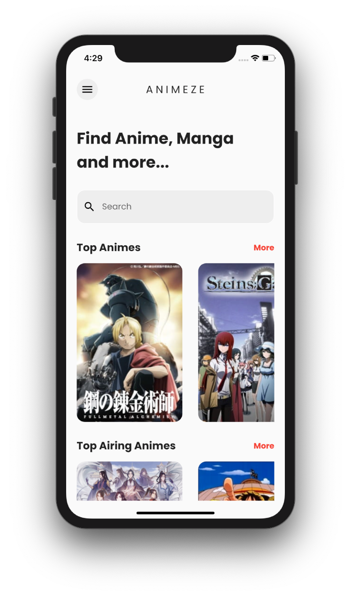
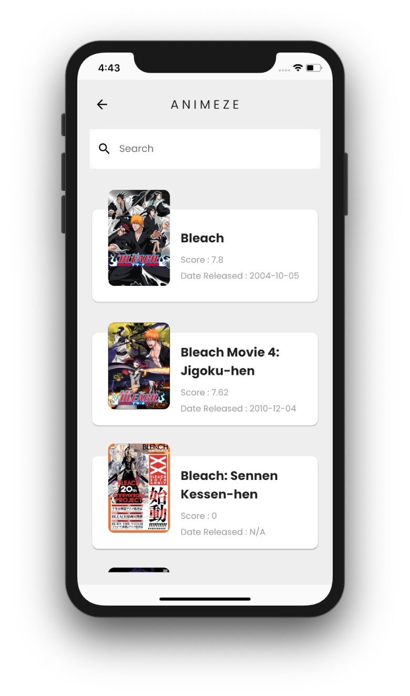
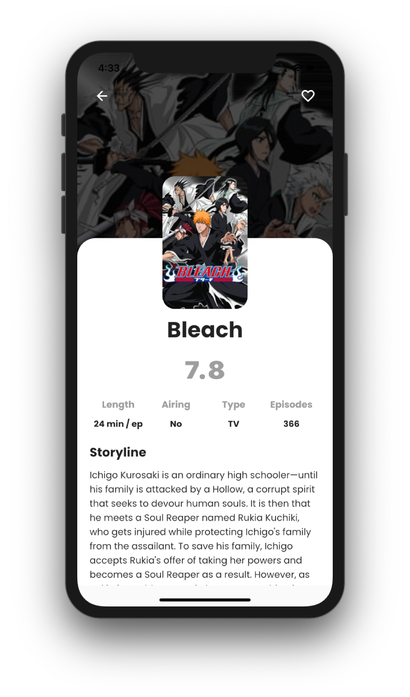
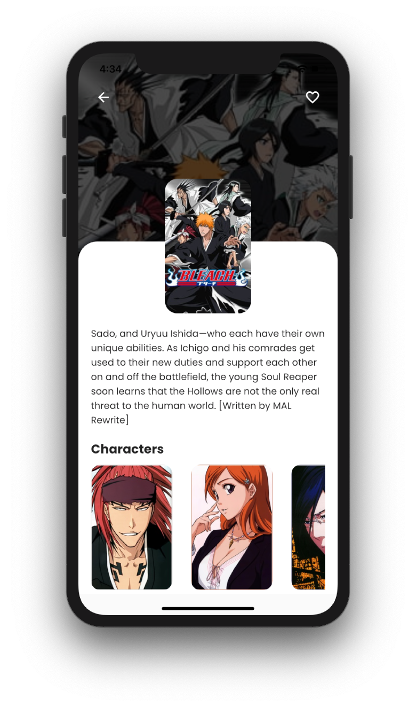
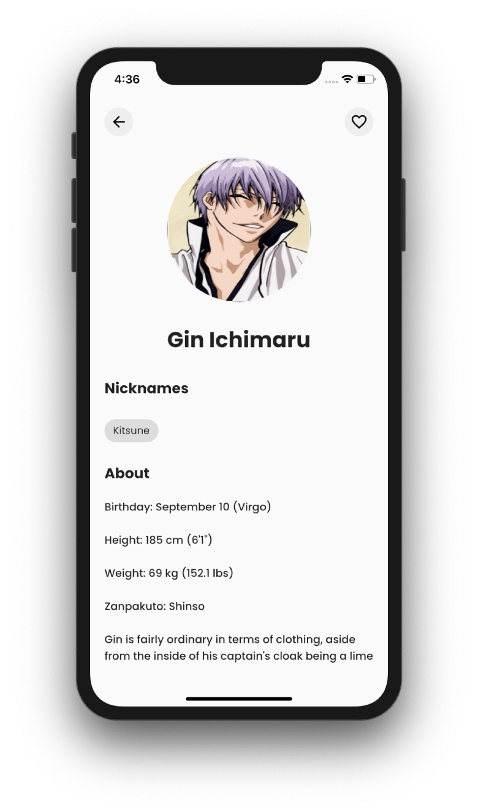

# Animeze

## Screenshot

  
  
  
  
  

## Overview

Animeze is an app which shows information regarding Animes. Browse through the list of all the animes. The app incorporates:

- Flutter
- Jikan API
- Provider
- Sqflite
- Flutter Spinkit

Future updates will include :

- Connecting the app with a backend
- Add a Dark Mode

## Getting Started

> This app is not available on the App Store.

This project is a starting point for a Flutter application.

A few resources to get you started if this is your first Flutter project:

- [Lab: Write your first Flutter app](https://flutter.dev/docs/get-started/codelab)
- [Cookbook: Useful Flutter samples](https://flutter.dev/docs/cookbook)

For help getting started with Flutter, view our
[online documentation](https://flutter.dev/docs), which offers tutorials,
samples, guidance on mobile development, and a full API reference.
